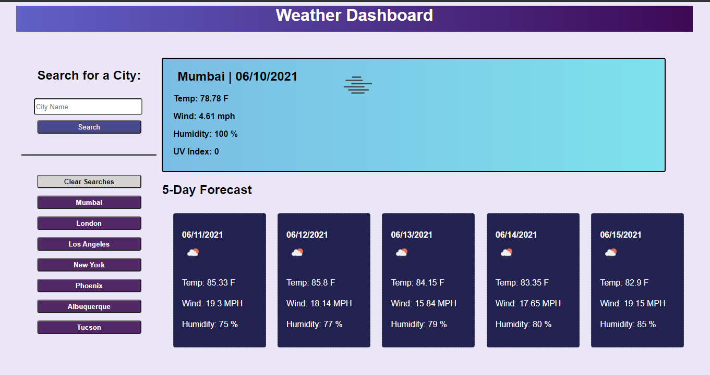

# Weather-Dashboard

## Table of Contents

* Description
* Usage
* Images
* License

## Description

> Goals for this assignment included the following:

1. Create a Weather Dashboard web application that displays current weather as well as a 5-Day forecast.

2. Use OpenWeatherMap API to fetch weather data based on input from the user.

## Usage

> Access the webpage here: <https://pao1ag.github.io/Weather-Dashboard/>

This web application can be used to look up the weather information of major cities around the world. Buttons of city searches are dynamically created on the page so that the user can quickly access the weather of their favorite cities. City searches can also be cleared with a click of a button.

## Images

## License

This project is licensed under MIT License.